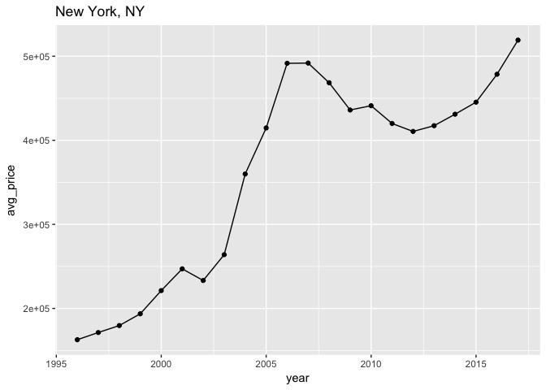
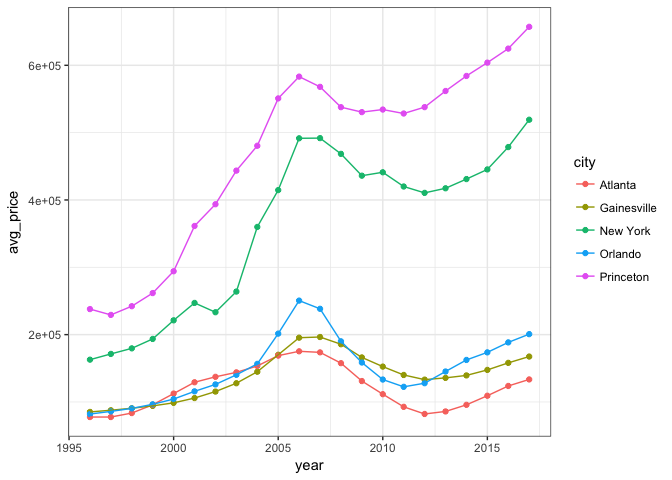
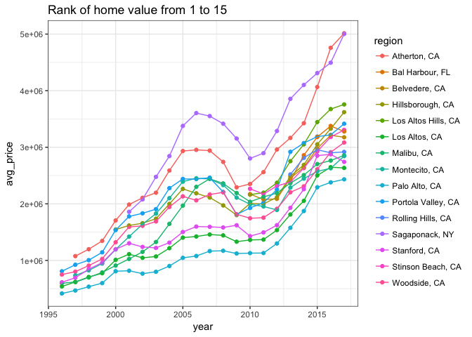

Home Value Analysis
================

### Useful links deal with home value data

-   python [네이버 부동산 crawling](http://nbviewer.jupyter.org/urls/financedata.github.io/posts/naver-land-crawling.ipynb) [조인스랜드 부동산 crawling](http://nbviewer.jupyter.org/urls/financedata.github.io/posts/joins-land-crawling.ipynb) `Ajax` `selenium`

``` r
df.all<-read.csv("City_Zhvi_3bedroom.csv")
df.all%>%str
```

    ## 'data.frame':    8955 obs. of  261 variables:
    ##  $ RegionID  : int  6181 12447 17426 13271 40326 18959 54296 33839 25290 20330 ...
    ##  $ RegionName: Factor w/ 7007 levels "Abbeville","Abbottstown",..: 4084 3345 979 4643 4650 3146 5236 5242 2810 5239 ...
    ##  $ State     : Factor w/ 48 levels "AK","AL","AR",..: 34 5 15 38 4 33 5 5 10 5 ...
    ##  $ Metro     : Factor w/ 546 levels "","Aberdeen",..: 347 285 84 381 382 270 427 429 229 428 ...
    ##  $ CountyName: Factor w/ 840 levels "Ada","Adams",..: 620 449 177 589 468 151 669 682 230 670 ...
    ##  $ SizeRank  : int  1 2 3 4 5 6 7 8 9 10 ...
    ##  $ X1996.04  : int  163500 153700 152800 42100 85200 119100 164500 216500 74100 285600 ...
    ##  $ X1996.05  : int  163500 153500 152500 42100 85500 118700 163700 216900 73900 287000 ...
    ##  $ X1996.06  : int  162900 153400 152100 42000 85700 118400 162800 217700 73700 288800 ...
    ##  $ X1996.07  : int  162300 153300 151700 41700 85900 118300 162100 218400 73700 290800 ...
    ##  $ X1996.08  : int  162200 153400 151400 41500 86000 118200 161400 219200 73700 292500 ...
    ##  $ X1996.09  : int  162300 153600 151000 41500 86500 118300 160600 220100 73400 293500 ...
    ##  $ X1996.10  : int  162500 153600 150800 41400 87100 118300 160100 221400 73100 294400 ...
    ##  $ X1996.11  : int  162800 153700 151000 41600 87600 118600 160200 223200 73300 296400 ...
    ##  $ X1996.12  : int  163100 154300 151500 41800 88000 119300 160900 225500 73700 298800 ...
    ##  $ X1997.01  : int  164100 155400 152200 41900 88700 120200 161800 228400 73900 301800 ...
    ##  $ X1997.02  : int  165900 156400 153000 41900 89400 120700 162700 230900 74300 304800 ...
    ##  $ X1997.03  : int  167800 157100 153700 42000 89700 121200 163400 233200 74500 307100 ...
    ##  $ X1997.04  : int  169400 157400 154400 42100 89700 121600 163800 235100 74600 309300 ...
    ##  $ X1997.05  : int  170500 157600 154900 42300 89900 121800 164200 237200 74800 312100 ...
    ##  $ X1997.06  : int  171500 157700 154900 42400 90300 121800 164500 239700 75000 315000 ...
    ##  $ X1997.07  : int  172600 157400 155000 42300 90600 121800 164800 242800 75200 318100 ...
    ##  $ X1997.08  : int  173700 157300 155500 42300 91000 121700 165400 246300 75400 321800 ...
    ##  $ X1997.09  : int  174400 157700 156100 42400 91400 121600 166800 249800 75800 325800 ...
    ##  $ X1997.10  : int  174800 158500 156600 42400 92000 121700 168500 253100 76400 330100 ...
    ##  $ X1997.11  : int  175400 159700 157200 42400 92600 122200 170200 256700 76800 333800 ...
    ##  $ X1997.12  : int  175900 160900 158000 42600 93300 122500 172000 260300 77100 337600 ...
    ##  $ X1998.01  : int  176300 162500 159000 43000 93900 122800 174200 263400 77400 342800 ...
    ##  $ X1998.02  : int  177300 164400 160000 43300 94500 123100 176300 266100 78000 347900 ...
    ##  $ X1998.03  : int  178400 165900 160700 43500 95200 123300 178200 268600 78400 351400 ...
    ##  $ X1998.04  : int  178800 167000 161000 43800 95700 123300 180000 270600 78300 353900 ...
    ##  $ X1998.05  : int  179000 168200 161600 43800 96200 123400 181700 272800 78300 357000 ...
    ##  $ X1998.06  : int  179200 169600 162500 43500 96800 123800 183300 275400 78500 360600 ...
    ##  $ X1998.07  : int  179400 171200 163300 43300 97600 124500 184900 278800 78600 364500 ...
    ##  $ X1998.08  : int  179900 173000 163900 43200 98300 125200 186800 281900 78500 367700 ...
    ##  $ X1998.09  : int  180500 174900 164400 43300 98700 125600 188600 284200 78800 370300 ...
    ##  $ X1998.10  : int  181200 177300 165200 43500 98900 125900 190400 286400 78800 372700 ...
    ##  $ X1998.11  : int  182200 179500 166200 43700 99500 125800 192300 288900 78400 375100 ...
    ##  $ X1998.12  : int  183300 181100 166900 43600 100400 125600 194100 291300 78400 377900 ...
    ##  $ X1999.01  : int  184400 182500 167800 43600 101600 125600 195600 293600 79300 381100 ...
    ##  $ X1999.02  : int  186200 183800 169100 43700 102400 125900 197200 295200 79900 383200 ...
    ##  $ X1999.03  : int  188100 184800 170400 43900 102500 126200 199100 296300 80400 384600 ...
    ##  $ X1999.04  : int  189500 185900 171800 44100 103000 126300 201400 297900 81200 387400 ...
    ##  $ X1999.05  : int  190800 187500 173500 44100 104000 126300 204000 300500 82000 391800 ...
    ##  $ X1999.06  : int  192100 189400 175400 44000 104500 126400 206900 304200 82400 396800 ...
    ##  $ X1999.07  : int  193300 191300 177400 44100 104600 126400 209900 309500 82800 403400 ...
    ##  $ X1999.08  : int  195200 192900 179400 44400 105200 126700 212500 315600 83200 411800 ...
    ##  $ X1999.09  : int  197600 194300 181600 44500 106200 127100 214600 322000 83700 421300 ...
    ##  $ X1999.10  : int  199900 195600 184000 44600 107000 127600 216800 329000 84200 431600 ...
    ##  $ X1999.11  : int  202100 197000 186100 44700 107700 128300 219200 336300 84700 443600 ...
    ##  $ X1999.12  : int  204200 198800 188000 44800 108400 129100 221700 343300 84900 457100 ...
    ##  $ X2000.01  : int  206300 200900 190400 45000 109100 129800 224700 351100 85400 471600 ...
    ##  $ X2000.02  : int  208800 203500 193000 45100 110000 130600 228500 360400 85800 486300 ...
    ##  $ X2000.03  : int  211300 206400 195400 45300 110900 131500 232500 370600 86100 500900 ...
    ##  $ X2000.04  : int  213400 208900 197500 45400 111800 132100 236600 381300 86300 514400 ...
    ##  $ X2000.05  : int  215800 211000 199500 45700 112800 132400 240500 392500 86700 526600 ...
    ##  $ X2000.06  : int  218800 213000 201300 45900 114000 132600 244000 402500 87300 537600 ...
    ##  $ X2000.07  : int  222100 215000 203500 46100 114900 132800 247400 410100 87900 546000 ...
    ##  $ X2000.08  : int  225400 216900 206300 46400 115200 133300 251400 416700 88300 550300 ...
    ##  $ X2000.09  : int  228700 218800 209400 46600 115600 134100 255600 423900 88700 552900 ...
    ##  $ X2000.10  : int  232100 220200 212700 46700 116100 134600 259200 431900 89200 556500 ...
    ##  $ X2000.11  : int  235000 221700 215600 46700 116300 135000 262400 439500 90000 560600 ...
    ##  $ X2000.12  : int  237200 223600 218100 46800 116700 135700 265900 445700 90400 562300 ...
    ##  $ X2001.01  : int  239600 225900 220100 46800 117400 136700 269800 450700 90800 560400 ...
    ##  $ X2001.02  : int  243000 228000 221800 46900 118300 137500 273600 454300 91100 558800 ...
    ##  $ X2001.03  : int  246400 230200 223400 47000 119200 138400 277500 455700 91500 560100 ...
    ##  $ X2001.04  : int  249000 232200 225500 47000 119800 139400 280700 454700 91800 560900 ...
    ##  $ X2001.05  : int  250000 234100 227700 47000 120400 140000 283100 452400 92300 558500 ...
    ##  $ X2001.06  : int  249600 235900 229000 47200 120900 140400 285300 448100 92700 556200 ...
    ##  $ X2001.07  : int  249100 237900 230200 47400 121000 140900 288000 442200 93100 555300 ...
    ##  $ X2001.08  : int  248900 240100 231900 47600 121200 141500 290400 437500 93700 557800 ...
    ##  $ X2001.09  : int  248500 242700 233900 47800 121600 142300 292200 434800 94400 563400 ...
    ##  $ X2001.10  : int  247700 245900 235800 48200 122100 143200 294200 432200 95000 566500 ...
    ##  $ X2001.11  : int  247100 249200 238000 48800 122700 144200 296900 427900 95500 566100 ...
    ##  $ X2001.12  : int  246200 251900 240100 49200 123500 145300 300100 423900 96200 566800 ...
    ##  $ X2002.01  : int  242700 254700 241900 49600 124400 146400 303600 422500 97000 571300 ...
    ##  $ X2002.02  : int  236300 257800 243400 50100 125100 147200 307300 424100 97700 575300 ...
    ##  $ X2002.03  : int  232400 260900 245000 50500 125800 147800 310400 428200 98400 576800 ...
    ##  $ X2002.04  : int  233700 264100 246400 50800 126400 148400 313800 434400 99100 579600 ...
    ##  $ X2002.05  : int  234800 267900 247400 51100 126800 149000 318300 441300 99700 588300 ...
    ##  $ X2002.06  : int  232700 272000 248800 51400 127300 149400 324200 447600 100300 599600 ...
    ##  $ X2002.07  : int  230500 276700 250900 51700 128500 149800 330600 452600 101000 611100 ...
    ##  $ X2002.08  : int  230300 281800 253100 52100 129900 150200 337000 456000 101600 621500 ...
    ##  $ X2002.09  : int  230800 286800 255300 52400 131100 151100 343400 458500 102400 628700 ...
    ##  $ X2002.10  : int  231200 291500 257700 52600 132100 152300 350700 460300 103100 632200 ...
    ##  $ X2002.11  : int  231400 296400 259900 52800 133000 153900 358100 461500 104100 635200 ...
    ##  $ X2002.12  : int  232300 301900 261800 53200 134000 155200 364500 461800 105200 637000 ...
    ##  $ X2003.01  : int  234200 307700 263400 53500 134900 156400 369500 461600 106200 636300 ...
    ##  $ X2003.02  : int  237000 312800 265800 53900 136000 157500 373900 460700 107200 635200 ...
    ##  $ X2003.03  : int  240200 318100 269100 54200 137100 158700 378100 459600 108000 635200 ...
    ##  $ X2003.04  : int  241000 323700 271800 54400 138000 159700 381200 458100 108800 636000 ...
    ##  $ X2003.05  : int  245200 328900 275100 54900 138600 160600 383600 456500 109400 637700 ...
    ##  $ X2003.06  : int  256300 333300 279900 55600 139000 161400 385800 456000 110500 642000 ...
    ##  $ X2003.07  : int  268100 338400 284500 56100 139400 162700 389000 457800 111800 647500 ...
    ##  $ X2003.08  : int  274500 344400 287300 56600 139600 164600 394300 461200 113100 651900 ...
    ##  $ X2003.09  : int  280600 350600 287900 57200 139500 167200 401600 463900 114100 653600 ...
    ##  $ X2003.10  : int  287800 357000 287400 57600 139500 170100 409700 465800 115100 657600 ...
    ##  $ X2003.11  : int  295700 364000 287100 58100 140300 173500 417900 468500 116300 665600 ...
    ##  $ X2003.12  : int  306800 371900 287800 58800 141300 177500 426700 473400 117300 676600 ...
    ##   [list output truncated]

``` r
region.info<-c("New York","NY")
#time 1800 08/04/17
getPrice_bycity(df.all,region.info)
```

    ## # A tibble: 22 x 4
    ## # Groups:   year, city [?]
    ##     year     city  state avg_price
    ##    <dbl>   <fctr> <fctr>     <dbl>
    ##  1  1996 New York     NY  162788.9
    ##  2  1997 New York     NY  171333.3
    ##  3  1998 New York     NY  179625.0
    ##  4  1999 New York     NY  193616.7
    ##  5  2000 New York     NY  221241.7
    ##  6  2001 New York     NY  247091.7
    ##  7  2002 New York     NY  233258.3
    ##  8  2003 New York     NY  263950.0
    ##  9  2004 New York     NY  359925.0
    ## 10  2005 New York     NY  414675.0
    ## # ... with 12 more rows

``` r
plotPrice_bycity(df.all,region.info)
```



``` r
df.region.info<-data.frame(
  city=c("Princeton","Gainesville","Atlanta","Orlando","New York"),
  state=c("NJ","FL","GA","FL","NY")
  )
df.region.info
```

    ##          city state
    ## 1   Princeton    NJ
    ## 2 Gainesville    FL
    ## 3     Atlanta    GA
    ## 4     Orlando    FL
    ## 5    New York    NY

``` r
df.Ncities<-getPrice_Ncities(df.all,df.region.info)
```

    ## Warning in bind_rows_(x, .id): Unequal factor levels: coercing to character

    ## Warning in bind_rows_(x, .id): binding character and factor vector,
    ## coercing into character vector

    ## Warning in bind_rows_(x, .id): binding character and factor vector,
    ## coercing into character vector

    ## Warning in bind_rows_(x, .id): Unequal factor levels: coercing to character

    ## Warning in bind_rows_(x, .id): binding character and factor vector,
    ## coercing into character vector

    ## Warning in bind_rows_(x, .id): binding character and factor vector,
    ## coercing into character vector

    ## Warning in bind_rows_(x, .id): binding character and factor vector,
    ## coercing into character vector

    ## Warning in bind_rows_(x, .id): binding character and factor vector,
    ## coercing into character vector

    ## Warning in bind_rows_(x, .id): binding character and factor vector,
    ## coercing into character vector

    ## Warning in bind_rows_(x, .id): binding character and factor vector,
    ## coercing into character vector

    ## Warning in bind_rows_(x, .id): binding character and factor vector,
    ## coercing into character vector

    ## Warning in bind_rows_(x, .id): binding character and factor vector,
    ## coercing into character vector

``` r
df.Ncities
```

    ## # A tibble: 110 x 4
    ## # Groups:   year, city [110]
    ##     year      city state avg_price
    ##    <dbl>     <chr> <chr>     <dbl>
    ##  1  1996 Princeton    NJ  237955.6
    ##  2  1997 Princeton    NJ  229283.3
    ##  3  1998 Princeton    NJ  242225.0
    ##  4  1999 Princeton    NJ  261733.3
    ##  5  2000 Princeton    NJ  294141.7
    ##  6  2001 Princeton    NJ  361375.0
    ##  7  2002 Princeton    NJ  393650.0
    ##  8  2003 Princeton    NJ  443600.0
    ##  9  2004 Princeton    NJ  480516.7
    ## 10  2005 Princeton    NJ  550833.3
    ## # ... with 100 more rows

``` r
df.Ncities%>%ggplot(aes(year,avg_price,group=city,colour=city))+
  geom_point()+
  geom_line()+
  theme_bw()
```



``` r
#def loadInfodf
loadInfdf<-function(Dat_frm, Ncol_cat=NULL, Range_ts=NULL){

tmp<-list()
if(is.null(Ncol_cat)){
 Ncol_cat<-c(1:6)
}
if(is.null(Range_ts)){
 Range_ts<- c("1996-04-01","2017-06-01")
}

tmp$CatColnames<-Dat_frm%>%names%>%.[Ncol_cat]
tmp$TsDates<-seq.Date(Range_ts[1]%>%as.Date,Range_ts[2]%>%as.Date,by="month")

return(tmp)
}

#def getPrice_bycity
getPrice_bycity<-function(Dat_frm,region.info){

Dat_frm.info<-loadInfdf(Dat_frm)
tmp<-data.frame(
price=Dat_frm%>%
  filter(RegionName==region.info[1])%>%
  filter(State==region.info[2])%>%
  select(-one_of(Dat_frm.info$CatColnames))%>%as.numeric(),
date=Dat_frm.info$TsDates,
city=region.info[1],
state=region.info[2]
)%>%
  mutate(year=lubridate::year(date))%>%
  group_by(year,city,state)%>%
  summarise(avg_price=mean(price,na.rm=TRUE))
return(tmp)
}

#def plotPrice_bycity
plotPrice_bycity<-function(Dat_frm,region.info){
  tmp.f<-getPrice_bycity(Dat_frm,region.info)%>%
    ggplot(data=.,aes(x=year,y=avg_price))+
    geom_point()+
    geom_line()+
    ggtitle("%s, %s"%>%sprintf(region.info[1],region.info[2]))
  return(tmp.f)
}


#def getPrice_Ncities

getPrice_Ncities<-function(Dat_frm, df.region.info){
  tmp<-list()
  for(line in 1:dim(df.region.info)[1]){
    region.info<-rep(0,2)
    region.info[1]<-df.region.info[line,1]%>%as.character()
    region.info[2]<-df.region.info[line,2]%>%as.character()
    tmp[[line]]<-getPrice_bycity(Dat_frm,region.info)
  }
  tmp%<>%do.call("rbind",.)
  return(tmp)  

}

#def plotPrice_byRank 

plotPrice_byRank<-function(Dat_frm, Rank){
  Dat_frm.info<-loadInfdf(Dat_frm )
  df.highest15.info<-Dat_frm%>%arrange(-X2017.06)%>%.[Rank,c(Dat_frm.info$CatColnames)]%>%
  select(RegionName,State)
names(df.highest15.info)=c("city","state")
df.Ncities<-getPrice_Ncities(Dat_frm,df.highest15.info)
df.Ncities%<>%group_by(city)%>%mutate(region=paste(city,state,sep=", "))
tmp.f<-df.Ncities%>%ggplot(aes(year,avg_price,group=region,colour=region))+
  geom_point()+
  geom_line()+
  theme_bw()+
  ggtitle("Rank of home value from %s to %s"%>%sprintf(range(Rank)[1],range(Rank)[2]))
return(tmp.f)
}
```

``` r
plotPrice_byRank(df.all,c(1:15))
```

    ## Warning in bind_rows_(x, .id): Unequal factor levels: coercing to character

    ## Warning in bind_rows_(x, .id): binding character and factor vector,
    ## coercing into character vector

    ## Warning in bind_rows_(x, .id): binding character and factor vector,
    ## coercing into character vector

    ## Warning in bind_rows_(x, .id): Unequal factor levels: coercing to character

    ## Warning in bind_rows_(x, .id): binding character and factor vector,
    ## coercing into character vector

    ## Warning in bind_rows_(x, .id): binding character and factor vector,
    ## coercing into character vector

    ## Warning in bind_rows_(x, .id): binding character and factor vector,
    ## coercing into character vector

    ## Warning in bind_rows_(x, .id): binding character and factor vector,
    ## coercing into character vector

    ## Warning in bind_rows_(x, .id): binding character and factor vector,
    ## coercing into character vector

    ## Warning in bind_rows_(x, .id): binding character and factor vector,
    ## coercing into character vector

    ## Warning in bind_rows_(x, .id): binding character and factor vector,
    ## coercing into character vector

    ## Warning in bind_rows_(x, .id): binding character and factor vector,
    ## coercing into character vector

    ## Warning in bind_rows_(x, .id): binding character and factor vector,
    ## coercing into character vector

    ## Warning in bind_rows_(x, .id): binding character and factor vector,
    ## coercing into character vector

    ## Warning in bind_rows_(x, .id): binding character and factor vector,
    ## coercing into character vector

    ## Warning in bind_rows_(x, .id): binding character and factor vector,
    ## coercing into character vector

    ## Warning in bind_rows_(x, .id): binding character and factor vector,
    ## coercing into character vector

    ## Warning in bind_rows_(x, .id): binding character and factor vector,
    ## coercing into character vector

    ## Warning in bind_rows_(x, .id): binding character and factor vector,
    ## coercing into character vector

    ## Warning in bind_rows_(x, .id): binding character and factor vector,
    ## coercing into character vector

    ## Warning in bind_rows_(x, .id): binding character and factor vector,
    ## coercing into character vector

    ## Warning in bind_rows_(x, .id): binding character and factor vector,
    ## coercing into character vector

    ## Warning in bind_rows_(x, .id): binding character and factor vector,
    ## coercing into character vector

    ## Warning in bind_rows_(x, .id): binding character and factor vector,
    ## coercing into character vector

    ## Warning in bind_rows_(x, .id): binding character and factor vector,
    ## coercing into character vector

    ## Warning in bind_rows_(x, .id): binding character and factor vector,
    ## coercing into character vector

    ## Warning in bind_rows_(x, .id): binding character and factor vector,
    ## coercing into character vector

    ## Warning in bind_rows_(x, .id): binding character and factor vector,
    ## coercing into character vector

    ## Warning in bind_rows_(x, .id): binding character and factor vector,
    ## coercing into character vector

    ## Warning in bind_rows_(x, .id): binding character and factor vector,
    ## coercing into character vector

    ## Warning in bind_rows_(x, .id): binding character and factor vector,
    ## coercing into character vector

    ## Warning in bind_rows_(x, .id): binding character and factor vector,
    ## coercing into character vector

    ## Warning: Removed 87 rows containing missing values (geom_point).

    ## Warning: Removed 87 rows containing missing values (geom_path).


